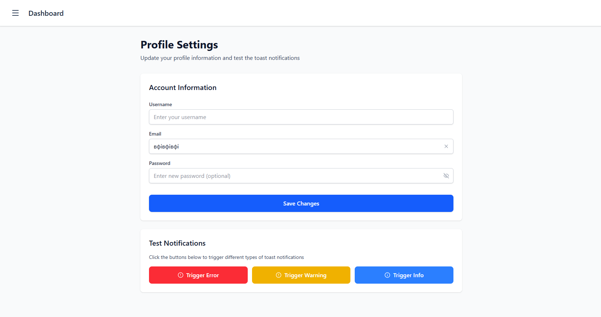
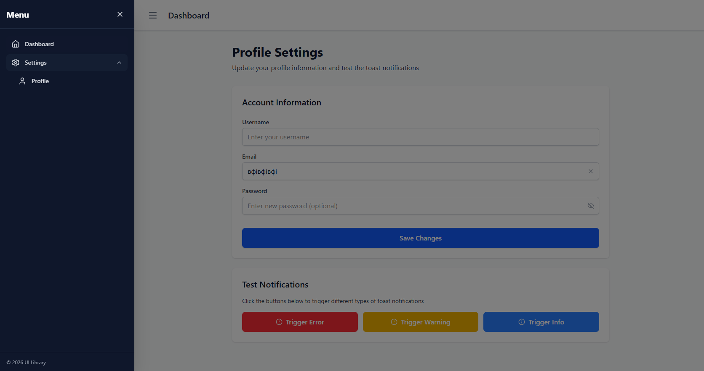
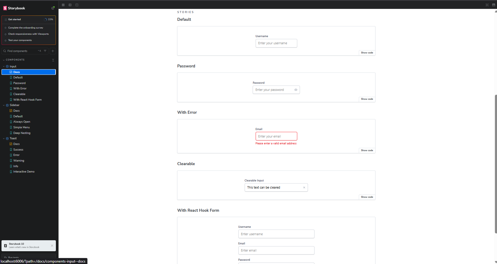
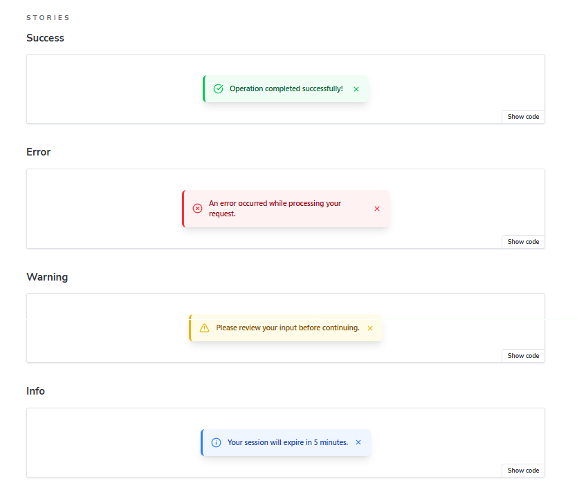
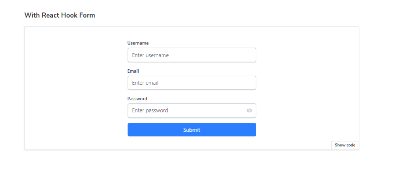

# React UI Component Library 🎨

> A modern, lightweight, and accessible React component library built with **TypeScript**, **Tailwind CSS**, and **Framer Motion**. Fully documented with **Storybook**.



---

## ✨ Features

### 🗂️ Recursive Sidebar Menu
A fully responsive, collapsible sidebar navigation component with unlimited nesting support.

- ✅ **Recursive Rendering** - Supports unlimited levels of nested menu items
- ✅ **Smooth Animations** - Slide-in and accordion effects with Framer Motion
- ✅ **Mobile-Friendly** - Backdrop overlay with hamburger toggle button
- ✅ **Dark Mode Ready** - Built-in dark mode support

### ⌨️ Smart Input Component
A flexible and feature-rich input field wrapper with validation support.

- ✅ **Password Toggle** - Show/hide password with eye icon
- ✅ **Clearable** - Clear button appears when field has value
- ✅ **Error States** - Built-in validation error display
- ✅ **React Hook Form** - Fully compatible with form libraries
- ✅ **TypeScript** - Properly typed with autocompletion

### 🔔 Toast Notifications
A dynamic notification system with multiple variants and auto-dismiss.

- ✅ **4 Variants** - Success, Error, Warning, and Info types
- ✅ **Auto-dismiss** - Configurable duration with smooth animations
- ✅ **Stack Support** - Multiple toasts display in bottom-right corner
- ✅ **Manual Close** - Close button for user control

---

## 🛠️ Tech Stack

| Category | Technologies |
|----------|-------------|
| **Framework** | React 18 + Vite |
| **Language** | TypeScript |
| **Styling** | Tailwind CSS, clsx, tailwind-merge |
| **Animations** | Framer Motion |
| **Icons** | Lucide React |
| **Documentation** | Storybook 8 |
| **Routing** | React Router v6 |

---

## 📦 Installation

### Clone and Install

```bash
git clone <your-repo-url>
cd ui-library
npm install
```

### Required Dependencies

```bash
npm install tailwind-merge clsx lucide-react framer-motion react-hook-form
```

---

## 🚀 Getting Started

### Development Server

Run the dashboard demo application:

```bash
npm run dev
```

Then open [http://localhost:5173](http://localhost:5173) in your browser.

### Storybook

Explore components in isolation with interactive documentation:

```bash
npm run storybook
```

Then open [http://localhost:6006](http://localhost:6006) to view the component library.

---

## 📸 Screenshots

### 🖥️ Dashboard Demo
Complete integration showing all components working together.


### 📂 Nested Sidebar Navigation
Multi-level menu items with recursive rendering.



### ⌨️ Input Variants
Password toggle, clearable fields, and error states.



### 🔔 Toast Notifications
All notification types in action.



### 🎯 React Hook Form Integration
Seamless validation with react-hook-form.



---

## 📁 Project Structure

```
src/
├── components/
│   ├── Input/
│   │   ├── Input.tsx
│   │   └── Input.stories.tsx
│   ├── Toast/
│   │   ├── Toast.tsx
│   │   └── Toast.stories.tsx
│   ├── Sidebar/
│   │   ├── Sidebar.tsx
│   │   ├── SidebarItem.tsx
│   │   ├── types.ts
│   │   └── Sidebar.stories.tsx
│   └── Layout/
│       └── Layout.tsx
├── features/
│   └── Dashboard.tsx
├── lib/
│   └── utils.ts
└── routes/
    └── BasicDataRouter.tsx
```

---

## 🎯 Component Usage

### Input Component

```tsx
import Input from './components/Input/Input';

<Input
  label="Email"
  type="email"
  placeholder="Enter your email"
  clearable
  onClear={() => setValue("")}
  error="Invalid email address"
/>
```

### Toast Notification

```tsx
import Toast from './components/Toast/Toast';

<Toast
  id="unique-id"
  message="Profile updated successfully!"
  type="success"
  duration={3000}
  onClose={(id) => removeToast(id)}
/>
```

### Sidebar Navigation

```tsx
import Sidebar from './components/Sidebar/Sidebar';

const menuItems = [
  { label: "Dashboard", href: "/", icon: Home },
  {
    label: "Settings",
    icon: Settings,
    children: [
      { label: "Profile", href: "/profile", icon: User }
    ]
  }
];

<Sidebar
  isOpen={isOpen}
  onClose={() => setIsOpen(false)}
  items={menuItems}
/>
```

---

## ✅ Features Checklist

- [x] **Input Component**
  - [x] Multi-type support (text, email, password)
  - [x] Password visibility toggle
  - [x] Clearable functionality
  - [x] Error state display
  - [x] React Hook Form integration

- [x] **Toast Notifications**
  - [x] 4 variants (success, error, warning, info)
  - [x] Auto-dismiss with configurable duration
  - [x] Smooth entry/exit animations
  - [x] Manual close button

- [x] **Sidebar Navigation**
  - [x] Slide-in animation
  - [x] Recursive nested items
  - [x] Mobile-responsive overlay
  - [x] Dark mode support

- [x] **Documentation**
  - [x] Storybook stories for all components
  - [x] Interactive demos
  - [x] React Hook Form bonus example

- [x] **Tech Stack**
  - [x] TypeScript for type safety
  - [x] Tailwind CSS for styling
  - [x] Framer Motion for animations

